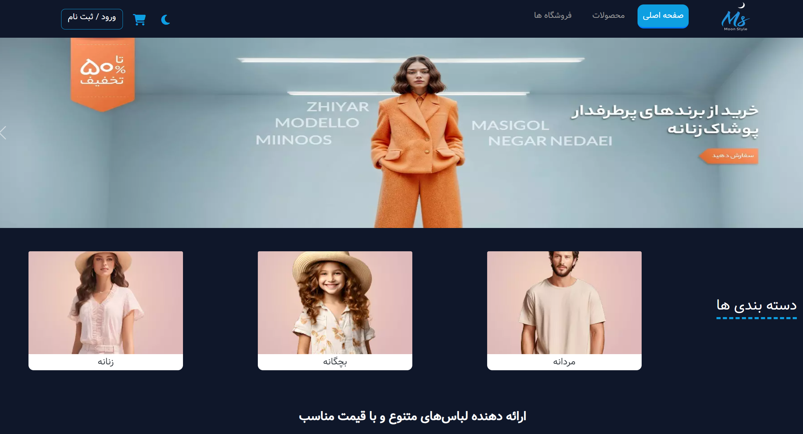
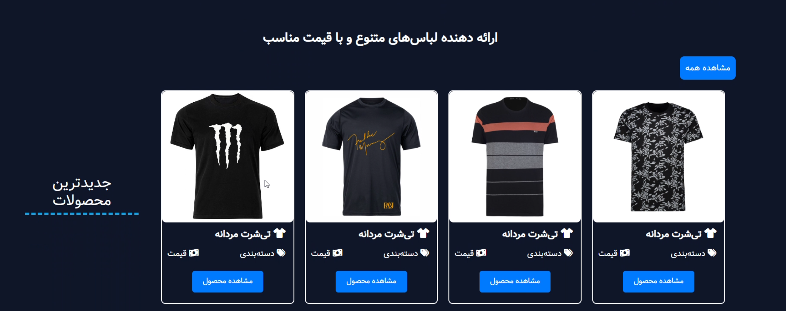
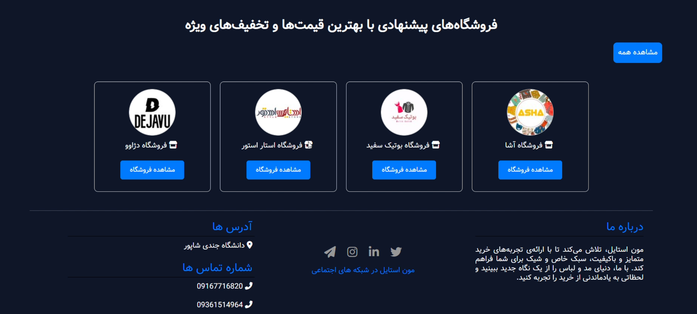

# Moon Style 👗🛒

Moon Style is a **university project** built with **Laravel** and **Blade**.  
It is a clothing store platform where different fashion shops can register, manage their products, and sell to customers.  

---

## 🚀 Features

- **Landing Page** with:
  - Categories: Men, Women, Kids
  - Featured Products section
  - Stores showcase (each store has its own product page)
- **Multi-store Platform**:
  - Shops can register and get a panel to manage their products
  - Customers can browse and purchase items from different stores
- **Admin Panel**:
  - Manage users, shops, and products
- **Seller Panel**:
  - Add and update products
  - Manage store details
- **Authentication system** for users, sellers, and admins

---

## 🖼️ Screenshots

Here are some screenshots of the landing page:

### Hero Section


### Featured Products


### Stores Showcase


---

## ⚙️ Installation & Setup

Follow these steps to run the project locally:

### 1. Clone the repository
```bash
git clone https://github.com/your-username/moon-style.git
cd moon-style
